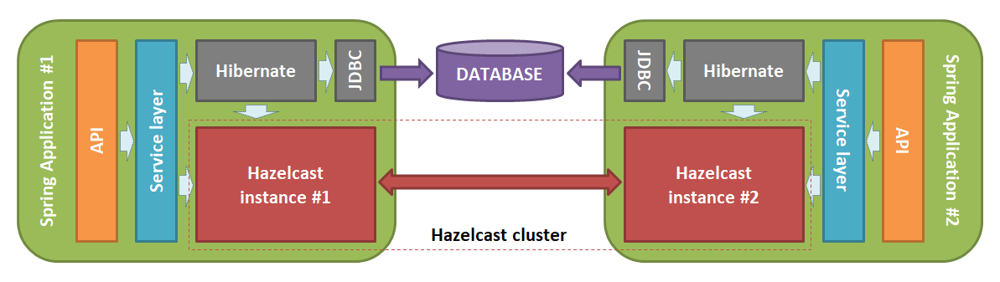
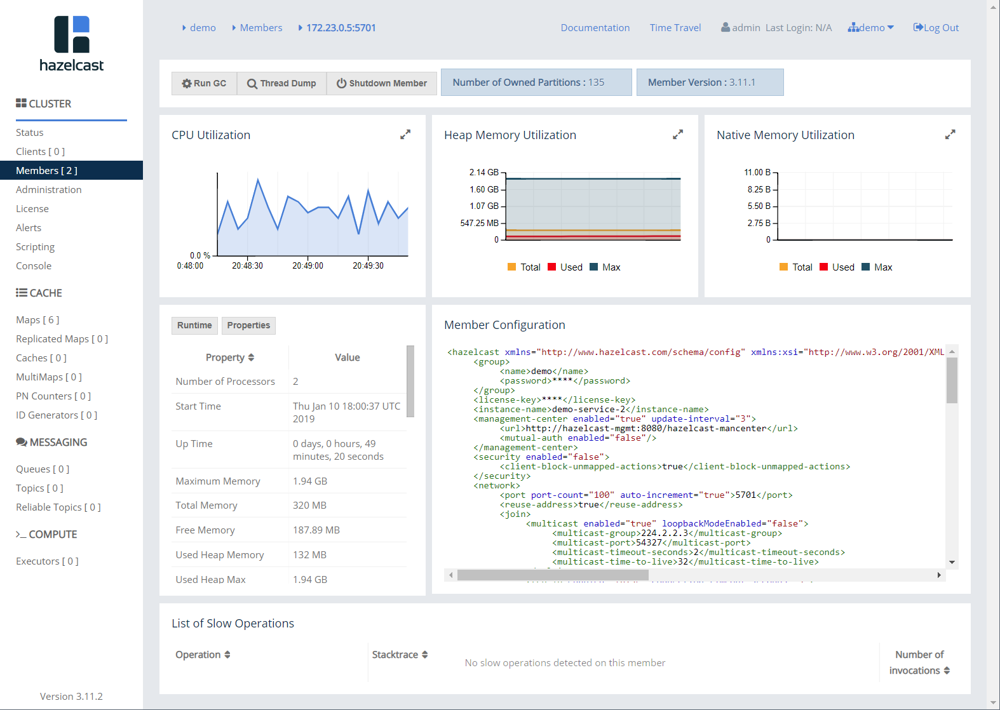
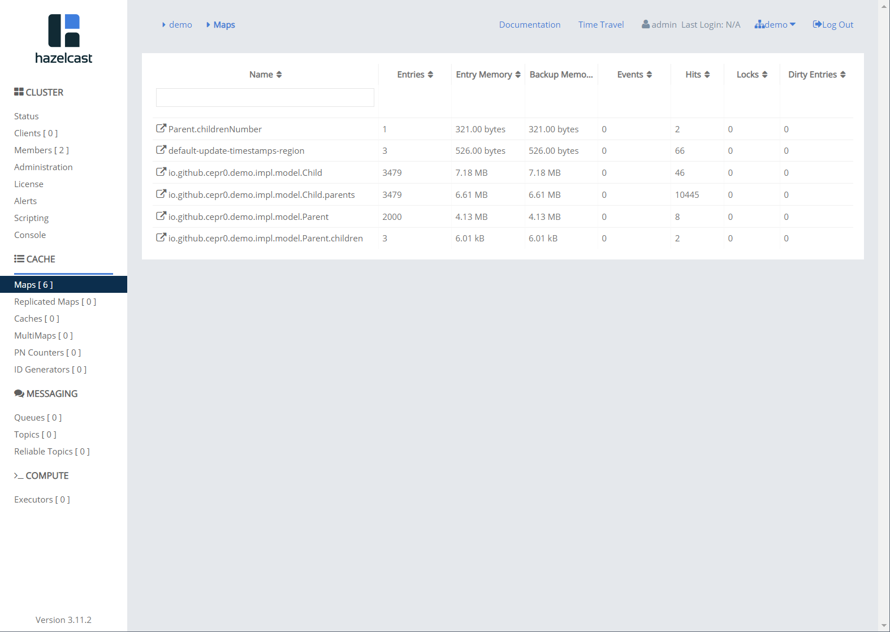

Hazelcast as distributed Hibernate 2nd level cache and Spring cache in Spring Boot application
----------------------------------------------------------------------------------------------

### What we try to implement

We want to setup a Hazelcast node in every instance of our demo Spring Boot application and use 
the resulting Hazelcast cluster as distributed Hibernate 2nd level cache and Spring cache. 
Something like this:

  

Then we will prepare a Docker compose file to launch this configuration automatically in the Docker environment.

Used technological stack:

- Java 11
- Spring Boot 2.1.1
- Hazelcast 3.11.1
- Spring Web MVC
- Spring Data JPA
- Hibernate
- MapStruct
- Flyway
- Lombok
- Log4jdbc
- PostgreSQL

### Settings

1. Among others, we add the following Hazelcast dependencies to the project:

```xml
<properties>
    <hazelcast.version>3.11.1</hazelcast.version>
</properties>

<dependencies>
    <dependency>
        <groupId>com.hazelcast</groupId>
        <artifactId>hazelcast</artifactId>
        <version>${hazelcast.version}</version>
    </dependency>

    <dependency>
        <groupId>com.hazelcast</groupId>
        <artifactId>hazelcast-client</artifactId>
        <version>${hazelcast.version}</version>
    </dependency>

    <dependency>
        <groupId>com.hazelcast</groupId>
        <artifactId>hazelcast-spring</artifactId>
        <version>${hazelcast.version}</version>
    </dependency>

    <dependency>
        <groupId>com.hazelcast</groupId>
        <artifactId>hazelcast-hibernate53</artifactId>
        <version>1.3.0</version>
    </dependency>
</dependencies>
```

2) According to [Spring Boot reference guide](https://docs.spring.io/spring-boot/docs/current/reference/htmlsingle/#boot-features-hazelcast) 
we should define a `com.hazelcast.config.Config` bean:

```java
@Slf4j
@Configuration
@EnableConfigurationProperties(HazelcastProperties.class)
public class HazelcastConfig {

	private final HazelcastProperties properties;

	public HazelcastConfig(HazelcastProperties properties) {
		this.properties = properties;
	}

	@Bean
	public Config config() {
		Config config = new Config();
		config.setInstanceName(properties.getInstance());
		config.getGroupConfig().setName(properties.getGroup());

		log.debug("[d] Hazelcast port: {}", properties.getPort());
		config.getNetworkConfig().setPort(properties.getPort());

		String managementCenterUrl = properties.getManagementCenterUrl();
		if (managementCenterUrl != null) {
			log.debug("[d] Hazelcast management center URL: {}", managementCenterUrl);
			config.getManagementCenterConfig()
					.setUrl(managementCenterUrl)
					.setEnabled(true);
		}
		return config;
	}
}
```

We set:

- Hazelcast instance name;
- [Cluster group name](https://docs.hazelcast.org/docs/latest/manual/html-single/#creating-cluster-groups); 
which we want to connect to - corresponded to our app name;
- TCP port number of the instance;
- and address of Hazelcast management center (optional).

By default, Hazelcast uses multicast to discover other members that can form a cluster, 
so we don't need to set this explicitly to work in Docker.   
    
Configuration parameters we get from our `HazelcastProperties` class:

```java
@Getter
@Setter
@Validated
@ConfigurationProperties("hzc")
public class HazelcastProperties {
	@NotBlank private String instance;
	@NotBlank private String group;
	private Integer port = 5701;
	private String managementCenterUrl;
}
```  

The port of Hazelcast instance is **5701** by default. You can set another value of `hzc.port` property, to launch 
instances of your application with Hazelcast on different ports (for example to run your app in the IDE).

Address of management center can be set like this:

```yaml
hzc:
  management-center-url: http://localhost:8080/hazelcast-mancenter
```
 
3) Next we have to define `org.springframework.cache.CacheManager` bean to use Hazelcast as 
[cache provider](https://docs.spring.io/spring-boot/docs/current/reference/htmlsingle/#boot-features-caching-provider-hazelcast): 

```java
@EnableCaching
@Configuration
public class CacheConfig {

	@Bean
	public CacheManager cacheManager(HazelcastInstance hazelcastInstance) {
		return new HazelcastCacheManager(hazelcastInstance);
	}
}
```

We define `CacheManager` bean with `hazelcastInstance` which is autoconfigured by Spring based on our `HazelcastConfig`.

4) We add the following lines to our application properties so that Hibernate 
uses Hazelcast as [a cache for entities and queries](https://github.com/hazelcast/hazelcast-hibernate). 

```yaml
spring:
  jpa:
    properties:
      hibernate:
        cache:
          use_second_level_cache: true
          use_query_cache: true
          use_minimal_puts: true
          hazelcast:
            instance_name: ${hzc.instance}
            shutdown_on_session_factory_close: false
          region:
            factory_class: com.hazelcast.hibernate.HazelcastCacheRegionFactory
```

We use 'P2P' mode to connect to our Hazelcast instance, disable shutting it down during `SessionFactory.close()` (see [details](https://github.com/hazelcast/hazelcast-hibernate#setting-p2p-for-hibernate)); 
and set `com.hazelcast.hibernate.HazelcastCacheRegionFactory` as Hibernate RegionFactory.

5) To make Hibernate cache our entities and their collection properties we have to annotate them with Hibernate `@Cache` annotation, 
for example:

```java
@Entity
@Cache(usage = READ_WRITE)
public class Parent extends BaseEntity {

	@Column(columnDefinition = "text")
	private String name;

	@Cache(usage = READ_WRITE)
	@ManyToMany(mappedBy = "parents")
	private Set<Child> children;

	public Parent(String name) {
		this.name = name;
	}
}
``` 

In order to use Hibernate cache for queries as well, we have to add annotation `@QueryHint` with `org.hibernate.cacheable` hint 
to query methods of our repositories, for example:

```java
public interface BaseRepo<T extends BaseEntity> extends JpaRepository<T, Integer> {

	@QueryHints(value = @QueryHint(name = CACHEABLE, value = "true"))
	@Override
	@NonNull
	Optional<T> findById(@NonNull Integer id);

	@QueryHints(value = @QueryHint(name = CACHEABLE, value = "true"))
	@Override
	@NonNull
	List<T> findAll();
}
```  

6) To make Hazelcast cache our methods, for example in the service layer, we use Spring `@Cache*` annotations, for example:

```java
	@Cacheable("Parent.childrenNumber")
	public ChildrenNumberDto getChildrenNumber(Integer parentId) {
		ChildrenNumberProjection projection = ((ParentRepo) repo).getChildrenNumber(parentId);
		return ((ParentMapper) mapper).toChildrenNumberDto(projection);
	}

	@CacheEvict(value = "Parent.childrenNumber", key = "#parentId")
	@Override
	public void delete(Integer parentId) {
		super.delete(parentId);
	}
```  

### Docker  

We create `docker-compose.yml` file which contains definition of four services: two instances of our demo application,
hazelcast managements center and PostgreSQL server.

The first instance of our application will populate the demo data (see parameters `SPRING_PROFILES_ACTIVE=demo`, 
`SPRING_FLYWAY_ENABLED=true` and class `DemoData`). This data will be stored not only in database 
but also in Hazelcast cache during the startup of the instance.

The second instance depends on the first one and starts only then first one is fully started (see section `depends_on`).

Demo services are published on 8081 and 8082 ports.

PostgreSQL container is extended with small script which creates a demo database (see folder `./postgres`).       

Hazelcast management center is published on 8080 port.

### Launch and tests

To start the configuration, first build the application:

```bash
mvn clean package
```

then launch the configuration with: 

```bash
docker-compose up -d --build
```

After the system has stared type the following commands to see the logs of our demo services: 

```bash
docker-compose logs -f 
```

After logs have stopped blinking you can make requests to demo services, for example:

```http request
GET localhost:8081/parents/1
GET localhost:8081/parents/1/children
GET localhost:8081/parents/1/childrenNumber
GET localhost:8081/children/1465
GET localhost:8081/children/1465/parents
```

for several times and see how the cache is working.

Then you can change the port to 8082, run these requests again and see that distributed cache is worked as well.

To stop the cluster hit **Ctrl-C** to stop the logging and enter the command

```bash
docker-compose down
```
 
### Management center

When the cluster is running you can open management center: [http://localhost:8080/hazelcast-mancenter](http://localhost:8080/hazelcast-mancenter).
After the simple registration and authorization you will be able to see the details of Hazelcast cluster as well as 
Maps which are used for caching:

**Cluster member details**
 


**Map list**
 


**Map details**
 
